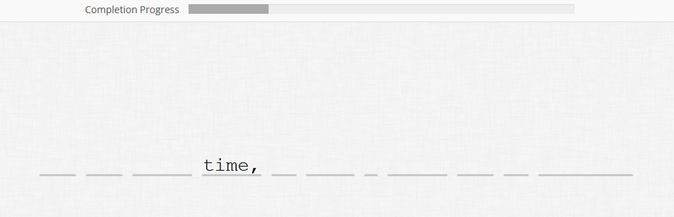

## Self-paced reading online experiment _(onx\_self-paced-reading)_

Online experiment to collect the reaction time (keyboard key pressed) while reading a word-by-word sentence.
 
The experiment was built using the jsPsych library, and a customized plugin has been created for the reading task (./lib/jspsych/plugins/jspsych-self-paced-reading.js)

Further details can be found in :
Rambelli G., A. Lenci, P. Blache. A Self-Paced Reading Study on Processing Constructions with Different Degrees of Compositionality. The 35th Annual Conference on Human Sentence Processing, Mar 2022, UC Santa Cruz, USA ([hal-03620795](https://hal.science/hal-03620795))

Example
**Figure 1** Example of the self-paced reading task
